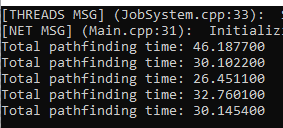
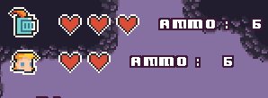
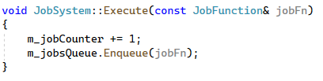
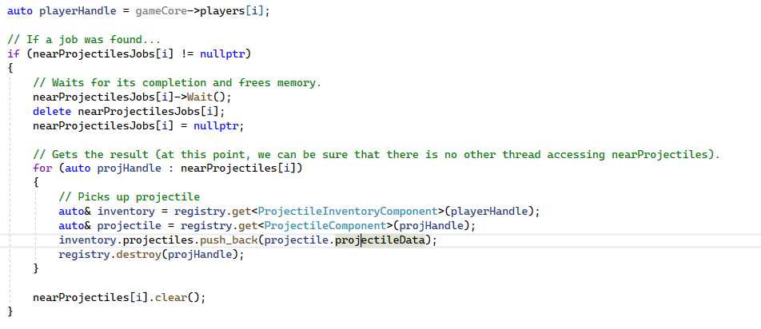
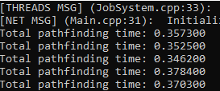

# Pixel Art Arena Game

<p align="center">
  <video autoplay="true" controls="false" src="./Res/gamePreview.m4v"/>
</p>


<!-- ABOUT THE PROJECT -->
## About The Project

A simple 16-bit arena game implemented in modern C++ that features a multithreaded Job System and an Entity Component System.

<!-- GETTING STARTED -->
## Getting Started

This project uses vcpkg for package management.

### Pre-requisites

* [vcpkg](https://github.com/microsoft/vcpkg)
* [Visual Studio Community 2022](https://visualstudio.microsoft.com/free-developer-offers/)

### Installation

1. Integrate vcpkg and Visual Studio:

	```sh
	vcpkg integrate install
	```

2. Install the required libraries:

	```sh
	box2d:x86-windows                                  2.4.1#1          An open source C++ engine for simulating rigid b...
	enet:x86-windows                                   1.3.17#1         Reliable UDP networking library
	entt:x86-windows                                   3.8.0#1          Gaming meets modern C++ - a fast and reliable en...
	glew:x86-windows                                   2.2.0            The OpenGL Extension Wrangler Library (GLEW) is ...
	glm:x86-windows                                    0.9.9.8#1        OpenGL Mathematics (GLM)
	nlohmann-json:x86-windows                          3.10.4           JSON for Modern C++
	opengl:x86-windows                                 0.0#9            Open Graphics Library (OpenGL)[3][4][5] is a cro...
	sdl2:x86-windows                                   2.0.16#1         Simple DirectMedia Layer is a cross-platform dev...
	tinyxml2:x86-windows                               9.0.0            A simple, small, efficient, C++ XML parser
	```

3. Clone the repository and navigate to its root folder.

4. Create a new project in visual studio, and include the repo's code. The vcpkg integration with visual studio automatically includes the installed libraries in the project.

6. Since the project uses C++20, watch [this video](https://www.youtube.com/watch?v=XsDR01GMxEI&t=140s) to learn how to enable C++20 in your project.

## How to play

The game only has one mode: two players in a 1v1. The player first moves with the WASD keys on the keyboard. By pressing the G key, player 1 starts preparing a projectile that can be thrown to damage opponents (monsters or other players). To aim the projectile, use the WASD keys on the keyboard. Player 2 has the same actions, but moves with the IJKL keys and shoots with P.





Periodically, monsters appear on the map. When a player comes into contact, the monster deals damage to the player. The player can shoot projectiles to kill the monsters. Also, projectiles can be used to shoot the other player, dealing damage.



The player who survives the longest or who reduces their opponent's health to zero wins.

## About pathfinding

Pathfinding is the means by which enemies find the player. In general, these algorithms boil down to finding the least expensive path in a graph to get to point B, starting from point A. We can represent the "level" at which the player and enemies are by a graph that determines how to jump in order to reach the platforms. Using a pathfinding algorithm (in the game's case, A*), the enemy finds the shortest possible path between the enemy and its target.


The problem here is that the game is needs to be updated in real-time, since the position of the player and enemies changes (almost) every frame. That is, 60 times per second. We don't need to run the pathfinding algorithm every frame (since the positions of game objects don't change instantly), but every X frames we need to do pathfinding for N enemies. An algorithm that is not that complex ends up becoming a bottleneck, and it competes for CPU time with rendering, physics, and game logic. In fact, let's look at an extreme case: putting 80 enemies on the screen at the same time, and making them all search for the player in the graph, we spend between 26 and 46 ms every X frames with pathfinding! This is a lot since we want to render the game 60 times per second (so each frame should last a maximum of 16.6 ms).


## About multithreading

To resolve the issue raised in [About pathfinding](#about-pathfinding), we can parallelize the A* pathfinding algorithm by using a [Job System](https://wickedengine.net/2018/11/24/simple-job-system-using-standard-c/). Including 80 enemies on the map, all running pathfinding algorithms in real time, we can still maintaining 60 frames per second without any trouble.
In fact, the parallelization decreased the pathfinding time from 32.8 ms to 0.37 ms!




## Authors

@PedroMartelleto